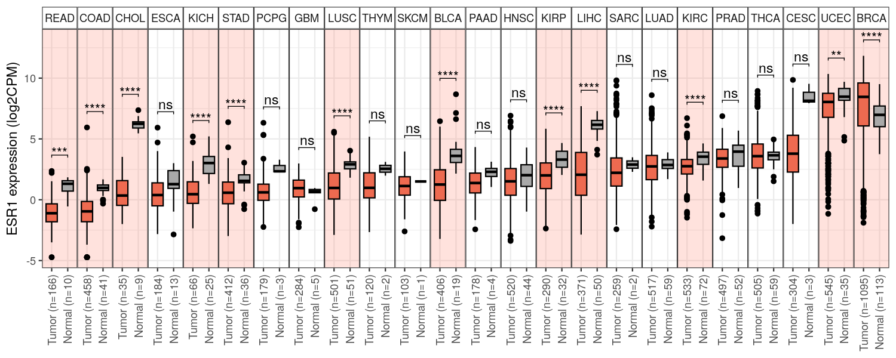

# 🧬 TCGA Pan-Cancer Visualizer

A containerized, end-to-end bioinformatics pipeline designed to download, normalize, and visualize RNA-seq expression data from the Genomic Data Commons (GDC). This tool automates the ingestion of all 33 TCGA projects and dynamically filters the dataset to generate publication-ready, statistically backed Pan-Cancer expression boxplots for the 24 cohorts that contain both normal and tumor tissue controls.

**Example Output: ESR1 (Estrogen Receptor 1) Expression Across TCGA Cohorts**


## 🏗  Repository Structure

```text
tcga-pan-cancer-visualizer/
├── Dockerfile              # Container definition (Bioconductor-based)
├── .dockerignore           # Prevents large files from breaking the Docker build
├── scripts/
│   ├── prepare_tcga_data.R # Orchestrates download, merge, and TMM normalization
│   └── plot_tcga_gene.R    # Generates statistical boxplots with significance levels
├── utils/
│   ├── batch_plot.sh       # Automation wrapper for multiple genes
│   └── check_progress.sh   # Monitoring tool for long-running downloads
└── examples/               # Example outputs (e.g., ESR1 validation plot)

```

## 🚀 Getting Started

### 1. Prerequisites

* **Docker** installed on your host machine.
* **System Requirements:** An instance with at least **32GB of RAM** (e.g., GCP `e2-standard-8`) is highly recommended for the final data merge and RDS generation.
* **Storage:** Approximately **50GB** of free disk space for raw data ingestion.

### 2. Prepare the Data Directory (CRITICAL)

To prevent Docker from attempting to load 50GB of raw data into the build context (which will crash your system), **you must create your data directory outside of this cloned repository.**

```bash
# Good: Creating the data folder in your home directory
mkdir ~/tcga_data

```

### 3. Build the Environment

Clone this repository, navigate into it, and build the Docker image:

```bash
git clone https://github.com/yigewu/tcga-pan-cancer-visualizer.git
cd tcga-pan-cancer-visualizer
docker build -t tcga-tool .

```

### 4. Run the Download & Normalization Pipeline

This step triggers the `gdc-client` to download the raw data using 10 parallel threads, followed by data merging and TMM normalization.
*Note: This process can take 10+ hours depending on your network bandwidth.*

```bash
# Map your external data directory to /data inside the container
docker run -d --name tcga_pipeline -v ~/tcga_data:/data tcga-tool \
  Rscript /app/scripts/prepare_tcga_data.R --outdir /data

```

### 5. Monitoring Progress

Since the pipeline runs as a background container (`-d`), you can monitor its progress in two ways:

**View the live Docker logs:**

```bash
docker logs -f tcga_pipeline

```

**Run the progress tracker script:**

```bash
# Ensure the script is executable first: chmod +x utils/check_progress.sh
./utils/check_progress.sh

```

## 📊 Generating Plots

Once the pipeline finishes and the `CPM.log2.RDS` file is generated, you can create "Tumor vs. Normal" boxplots for your genes of interest.

### Option A: Plot a Single Gene

Use this command to render a single plot (e.g., GAPDH). Make sure your output directory exists first (`mkdir -p ~/tcga_data/figures`).

```bash
docker run --rm \
    -v ~/tcga_data:/data \
    tcga-tool \
    Rscript /app/scripts/plot_tcga_gene.R \
    --expr /data/CPM.log2.RDS \
    --meta /data/RNAseq_Meta_Data.tsv \
    --gene_symbol "GAPDH" \
    --gene_id "ENSG00000111640" \
    --outdir /data/figures

```

### Option B: Batch Plotting

To automatically generate plots for multiple genes, edit the `HOST_DATA_PATH` and the `GENES` array inside `utils/batch_plot.sh`, then run:

```bash
./utils/batch_plot.sh

```
## 🧠 Design Rationale

### Why TMM Normalization?

While many public portals provide FPKM or standard TPM counts, these often fail to account for **RNA composition bias** when comparing vastly different tissues (e.g., highly metabolic Liver vs. quiescent Brain). By utilizing the Trimmed Mean of M-values (TMM) via `edgeR`, this pipeline ensures that cross-cancer comparisons remain statistically robust.

### R as the Orchestrator

Instead of forcing users to juggle separate Bash, Python, and R scripts to fetch manifests, download data, and merge matrices, `prepare_tcga_data.R` acts as a single, unified orchestrator that directly manages the `gdc-client` sub-processes.

## ✅ Validation Example: ESR1

To verify the integrity of the metadata mapping and normalization, **ESR1 (Estrogen Receptor 1)** serves as a built-in biological sanity check. When plotted, the visualizer correctly identifies massive expression exclusively in Breast (BRCA) and Endometrial (UCEC) cohorts, confirming the accuracy of the pipeline's tissue-type faceting.
